# Blog: Car Damage Analysis

**Name:** David Weir

**Supervisor:** Suzanne Little

## Introduction

I met with Suzanne on Wednesday the 3rd of October and pitched my project idea to her. I had emailed Suzanne, as well as Alan Smeaton, previously during the summer to ask for feedback on a few ideas I had for my project. Both offered some insightful feedback on the way I should go about the project as a whole.

The goal with this system is to automate the process by which cars are returned and inspected for external damages, using the car rental industry as an example but this could be employed by taxi companies, ride sharing, or insurance companies. An automated system would provide companies with a more reliable and cost saving method of vehicle monitoring.

I plan to create a machine learning model which will detect damage in images of cars and deploy it as part of an application used in car rentals agencies. The model will be created using transfer learning of a pre-trained model in TensorFlow.

## 1: The Project Proposal
##### 19/10/18

The proposal presentations have been scheduled for next week. I will be presenting on Thursday the 25th at 15:00. For this, I have to provide a quick walkthrough of the purpose of the project, how I will go about creating the project, and some of the major learning challenges involved with the project.

The panel will ask some questions about the project so I will need to prepare some of my research on the feasibility of the project, and the method of transfer learning I aim to be using.

For the proposal, I submitted two diagrams (pictured below) to describe how I hope the project will work at a high level.

|Enclosure Diagram|Proposed System Diagram|
|:---:|:---:|
| 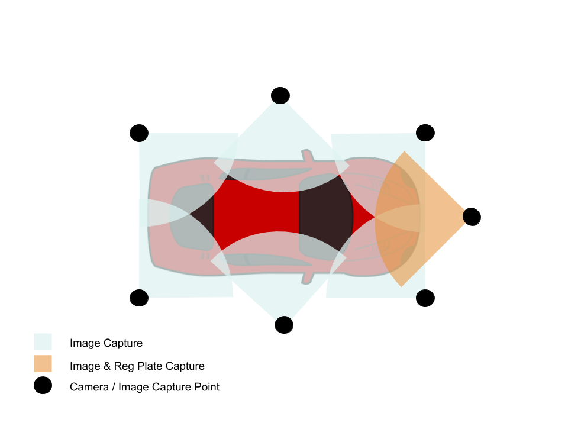 | 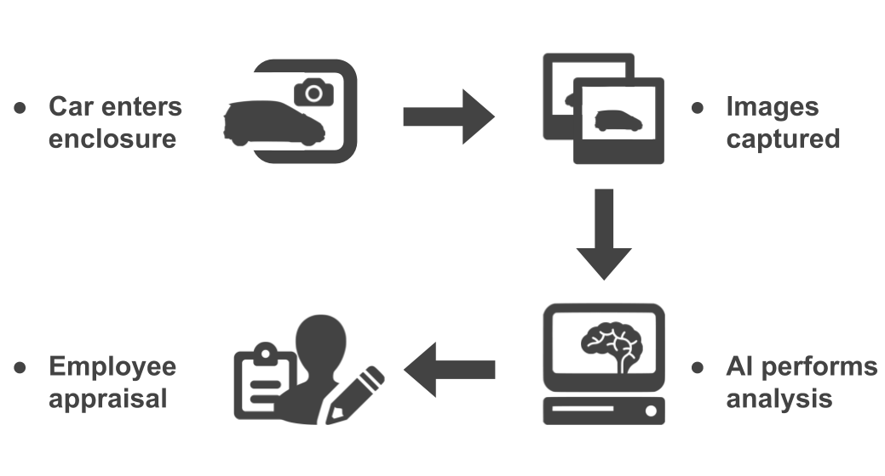 |

## 2: The Functional Specification
##### 24/11/18

Since my last blog my primary focus has been split between completing the functional specification and my assignments for other modules. After completing a presentation in my data mining module this week, my primary focus was shifted back to the completion of the functional spec, with my goal being to finish it by the original deadline of 23rd of November rather than waiting to finish it all within the week extension we were given. 

I finished up my functional spec late last night and I am uploading that draft as a pdf along with the commit for this blog entry.

Although I have completed the functional spec I am going to use the extra week to show my work to Suzanne before our meeting next Tuesday to see if she can provide any insight on the document.

I have had only one meeting with Suzanne since the project proposal, I think the plan for the meetings will be to have them roughly every two weeks. Suzanne was away last week so I instead scheduled a meeting for this Tuesday.

I plan in the next week to begin work on researching more image processing algorithms which might be useful for highlighting differences in photos and to begin some development work on the front-end and back-end systems which need to be developed in parallel to the image processing section. I have outlined the reasons for this parallel development in the functional spec in detail.

## 3. Final Meeting Before Semester 1 End
##### 5/12/18

I had my final meeting of this Semester with Suzanne yesterday. We mostly talked about possible solutions to the image processing portion of the project. My current dataset will have to change, I currently have two main categories which are damaged cars and undamaged cars. I will need a new dataset of cars before and after damage. This will allow me to create a service which will notice if a car has been damaged while on a rental rather than highlighting damage in an image of a car.

Once I have a basic system up and running, and if my before and after dataset is large enough, then I can begin to look into the possibility of using some machine learning methods to hopefully improve my results.

As for the software engineering aspects of the project, Suzanne seemed to agree with my proposal to keep each of the subsystems separated in a sort of microservices approach to the overall architecture. This architecture will allow me to more easily slot in new/test systems for the image processing aspect.

As we are coming up to the end of Semester and exams, my next meeting will take place in late January after we return for Semester 2

_Note: Uploading this late as I forgot to commit it earlier_

## 4. Post-Exam Updates
##### 22/01/19

The exams are over with for now, and there is a large amount of project work to be done. I will provide a quick update on the progress of the project in this blog.

UI:
* Basic templates in place for the web application.
* Content needs to be populated with calls from a rest-api.

|WIP Appraisals Page|
|:---:|
|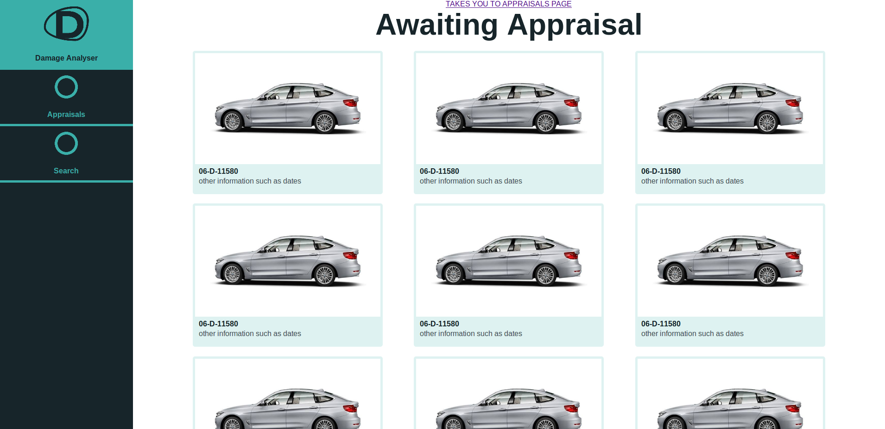|

Rest-API:
* Simple API set up using springboot
* Only two pieces of functionality in place at the moment
  * Return a test image
  * Return some example data for an appraisal
  
Image Processing:
* Very small amount of progress as this is the most research intensive aspect of the project.
* Python script in place to compare two images using only the extracted Surf features of each image.
* Still need to find a good metric to compare the two images with regards to the damage present in the after image.
* As you can see in the below image there a number of issues with feature matching with objects in the background, to combat this I will probably be cropping the images in the dataset. Images which will be passed to the actual system would be in the relatively controlled environment of the enclosure.

|Surf feature matching of the same car|
|:---:|
|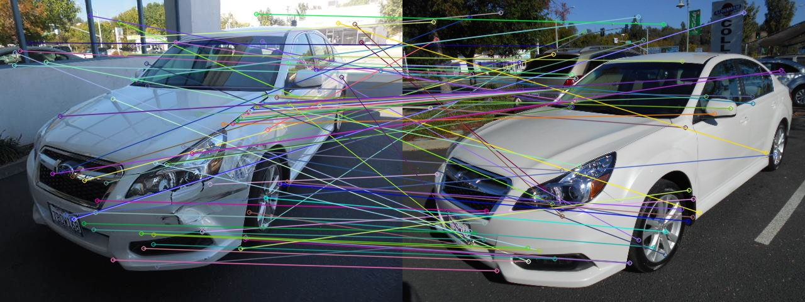|

## 5. Database Design
##### 28/01/19

I have recently begun the design of the database to be used for the project. I will be implementing it with MySql. I have a database in place at the moment to provide test data to the UI, but this needs to be replaced by a more structured database with some actual design in place for its relations.
 
 The new design of the database can be seen in the image below. I believe that this new database design covers the majority of the main functionality for overall system.

|New Database Design|
|:---:|
|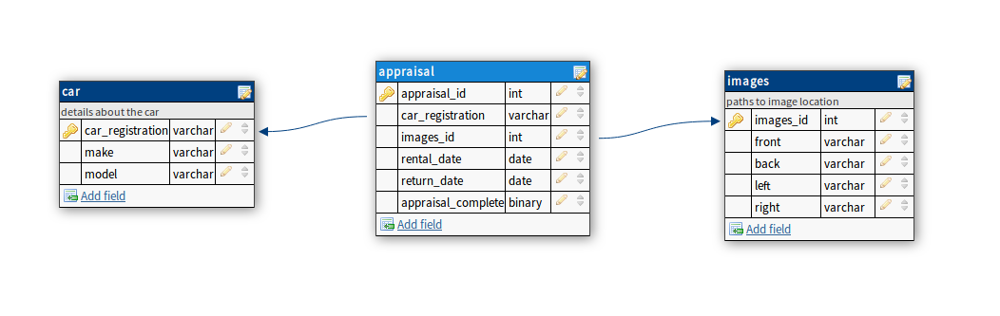|

* **The appraisal table** will store information related to each damage appraisal which must be undertaken by a rental company employee. In a larger production system, the rental_date and return_date fields would be replaced by a rental table which could contain even more information about each rental, this is out of scope for this project.
* **The car table** will contain the details of each car of the rental company, this information will be displayed to the employee when making an appraisal.
* **The images table** will contain file paths to each of the images relevant to an appraisal. It is best to store a reference to an image in the database rather than the image itself as storing them the image in the database can greatly increase the size of the database and increase it's efficiency. 

## 6. Semester 2 Meeting 1
##### 02/02/19

I had my first meeting of Semester 2 with Suzanne yesterday. The content of this meeting was mostly to do with my progress on the web app etc so far. Suzanne recommended that I be sure to document all progress I have with my development of the project and any validation I do for it, however minor. This will give me a good grounding when it comes to finalising all relevant documentation.

We also chatted about the necessary image processing for the project, which I have only a small amount of progress with after creating a new dataset. She suggested that the system should perform a 2 step process. 1. Compare all Sift descriptors which are matches and their surrounding area to ensure they are valud matches. 2. Analyse any points present in the after image for a car alone as clusters of this points could be possible areas of damage. These 2 steps would allow us to highlight areas of interest in the images. From there I can attempt further analysis to deduce if these areas are in fact areas of damage.

In regards to the dataset, Suzanne pointed out how I am currently missing before and after photos which do not contain damage. These images will be necessary to sanity test the accuracy of the model.

## 7. Predictions using Bag of Visual Words
##### 08/02/19

After some research, I have been struggling to devise a method which will allow me analyse the before and after images of cars with a reasonable amount of accuracy. There doesn't seem to be as much research into these 'spot-the-difference' type systems as there is into classification type systems. In its place for the moment, I have attempted to implement a system to classify an image as either scratched, dented or undamaged.

It seemed a bag of visual words approach would be best suited for classifying images using the surf features present in each of the dented, scraped and undamaged images of cars present in the older dataset I had created. In bag of visual words, the features for each of the classes are clustered using k-means. The centroid of these clusters are used in predictions of new images.

With my older dataset, roughly 2000 images (1000 undamaged, ~350 dented, ~650 scraped) using opencv and it's surf feature detection functions, I have been able to achieve a baseline accuracy of 59.8% overall. This is an adequate accuracy score for a first attempt I feel. 

The problem with this model is that it returns an accuracy of 0% for the dented class. I think this is due to the fact that surf feature detectors do not create much features for the gradient that defines a dent. As you can see in the image below there are only a small amount of features in the grayscale image around the dent. 

|Dent Surf Features|
|:---:|
|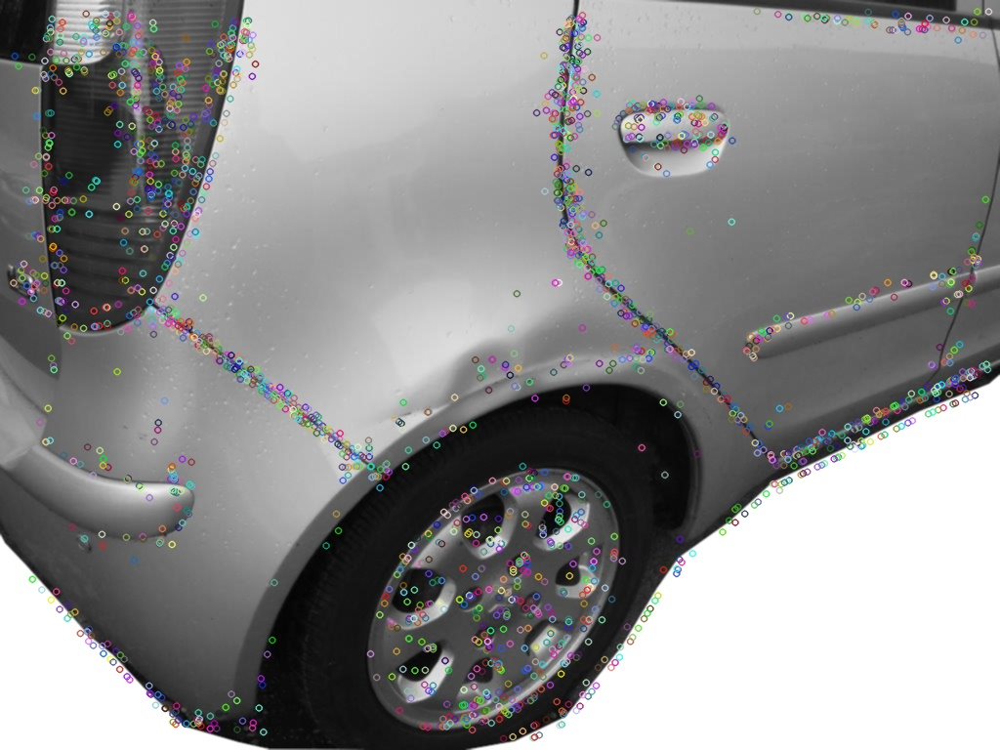|

## 8. Model Deployment 
##### 16/02/19

After creation of the base model talked about in my previous blog post I began to wonder how the model would be deployed in order to make predictions on the images captured by the enclosure. As the development of potential models took place in python I wanted to use python to deploy these models rather than having to convert them to Java just for the purposes of deployment. 

Instead I chose to create a smaller rest api using flask and python. This smaller rest api allows me to slot in improved damage analysis models with greater ease. Images are passed to the flask api from the enclosure via a http call, a prediction is then made on the images passed to the api, if damage is detected in any of the images then an appraisal is created via the spring api. 

This form of system architecture is similar to the increasingly popular form of micro service architecture, with each of the sections necessary for the system to function loosely coupled together. A similar approach was outlined in the functional specification which can be seen below.

 |System Architecture|
 |:---:|
 |.png)|
 
 ## 9. Semester 2 Meeting 2
 ##### 21/02/19
 
 I just completed my second meeting of semester 2 with Suzanne. I updated her on the progress of my damage analysis model (currently at 67%), and some of the features I added to my UI such as marking an appraisal as complete and adding a new car. We also discussed how I deployed my current model using Flask.
 
 Suzanne advised me to complete my Ethics form as soon as possible. She also advised that I keep on top of the testing of the project as I progress so not to fall behind. 
 
 In terms of improving the damage analyser, first I am going to attempt a similar approach using HOG descriptors rather than surf keypoints as HOG might be able to detect the gradient colour changes of a dent better than surf keypoints, but there is no real way of checking this until I can implement it and test.
 
 I knew that data augmentation would be an important aspect of improving my accuracy, things like small pivots and horizontal flips will increase the usefulness of the data I currently have. Suzanne suggested I investigate the use of sliding windows as part of my data augmentation. I don't know much about this at the minute so I will need to investigate before I attempt this.
 
Suzanne will be away for 1 month from this meeting so our next meeting will not take place until she is back. 

## 10. Adding Additional Tests
##### 01/03/19

As a testing and validation is an important aspect of this I have dedicated some of my time lately to implementing some additional tests to my project. I am doing these tests through the Angular testing module for my front end and through spring boot testing using Junit 4 for my rest api. 

For testing the UI, I had to implement mock functions to act as the returned values for http calls to the rest api. I then ensure that these returned values are parsed correctly by the angular functions implemented in each of the components in the angular project. Additionally, I have checks to ensure that the parsed values are displayed correctly in the template HTML for the component.

I am currently in the process of adding tests to the spring backend through Junit, I expect to have these finished by some time next week as I have to study for a lab exam.

Below is the coverage report for the Angular tests. As you can see some tests have still to be added to the search and new-car components.

 |Current Angular Test Coverage|
 |:---:|
 |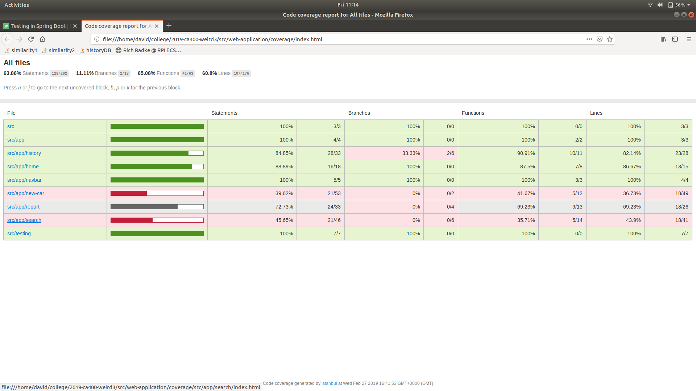|
 
 ## 11. UI Features & HOG Implementation
 ##### 07/03/19
 
 Over the past few days, I have been attempting improvements to the damage analyser model, as well as adding some much needed features to the overall system.
 
 On the report page for an appraisal I have added the ability to "zoom" into images by clicking on them. This will allow employees to view the images of damage in greater detail. To aid with usability, I have implemented the use of the arrow keys to change images as well as the escape key to close the zoomed image.
 
 In order to combat the damage analyser missing valid images of damage, 10% of all cars which are returned are sent to be analysed regardless of whether the model has classified the car as damaged or not. Employees will not be informed if the car has been predicted as damaged or if it has been randomly assigned. Over time this will help improve the model as more images of damage it has missed will be included when retraining the model.
 
 I have implemented an SVM which makes use of HOG descriptors to predict whether an image contains damage or not. My hope with this classifier was that it would better predict the dents which are present in the dataset. When predicting for undamaged, dented, and scraped, the model achieved an accuracy of 76%. 
 
 However, when predicting only for damaged or undamaged the model achieves an accuracy of 91%, this large increase is due to the fact that many of the dented images in the dataset were being classified as scraped. After further examining my data, I think this could possibly be an issue with the labeling of the data as many of the images which I labelled as dented contain a prominent number of scrapes in addition to the dents.
 
 I am not sure yet, but I think for the purposes of this project I may be better off predicting damaged vs undamaged as the classes of damage are not too important due to the fact that employees will have to appraise a car regardless of whether the damage is a dent or a scrape. 
 
 I plan to continue trying to improve the model to increase it's accuracy.
 
 
 ## 12. Data Augmentation
##### 11/03/19

In order to increase the usefulness of my data I have been trying to augment it so I can gain as much information as possible from each image. To do this I used what seemed to be the most straightforward method of data augmentation, using the ImageDataGenerator functions which are part of the Keras Tensorflow library. This library allows you to perform a number of operations on the images, such as adjusting brightness, cropping, zooming and flipping.

As each of the operations is changing the image in some way, I had to be careful to ensure that each operation would not cause the image to lose it's meaning. For instance, if a random crop happened to cut out the damage which is present in the image the image would lose it's meaning as no damage could then be seen. For this reason I could not use operations such as vertical flips as the car would then be upside down and thus the image would lose meaning.

For each image in the dataset I created 20 augmented images. I am having memory issues when training the HOG detector SVM with this data on a Google Cloud Platform instance, I have learned recently that SVM's struggle with large amounts of data. Some sites online have suggested that it may be time to ditch the SVM approach in favour of deep learning, however I dont think the size of my dataset would be considered that large yet (It now contains roughly 26000 images). If training the SVM with this new dataset increases accuracy I will update this blog post. 

## 13. Hardware
##### 22/03/19

I haven't wrote a blog in sometime due to the fact that I have been working in a new avenue of the projects development. Lately I have been prepping and beginning development of the model enclosure which will take images of the car. To do this I have a model police car which I have scraped in order to mock damage, you can see the car in the below images which show the original car and the painted version.

 | Before | After | Damaged | 
 |:---:|:---:|:---:|
 |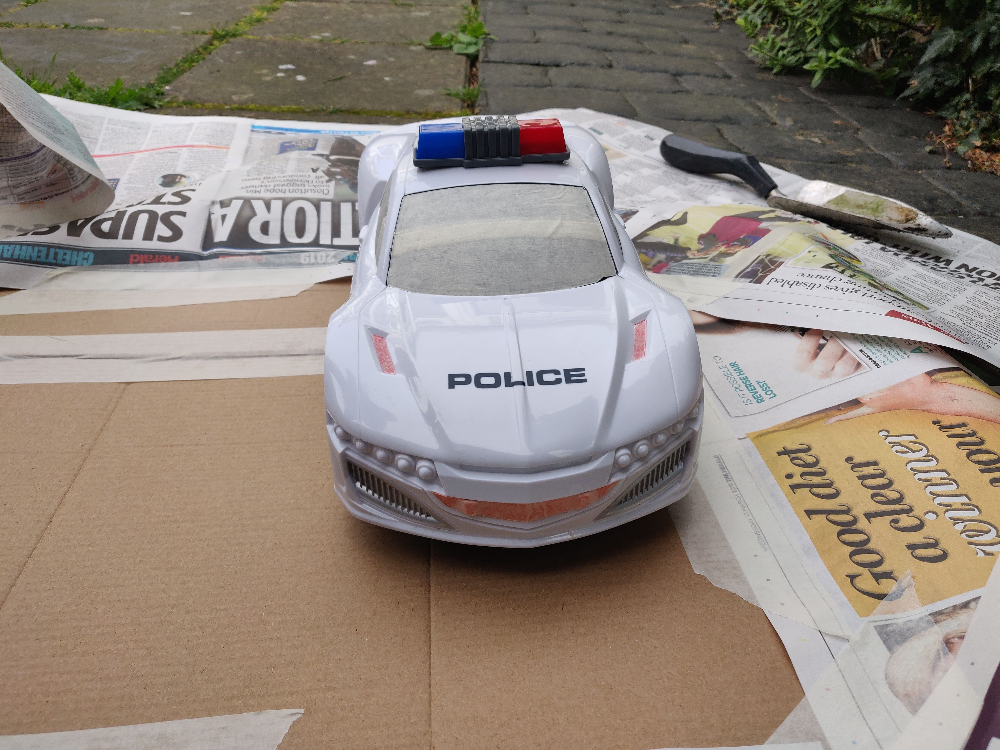|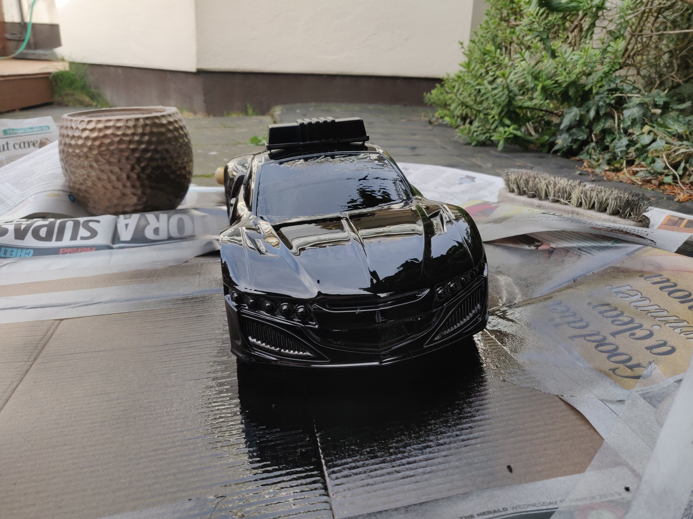|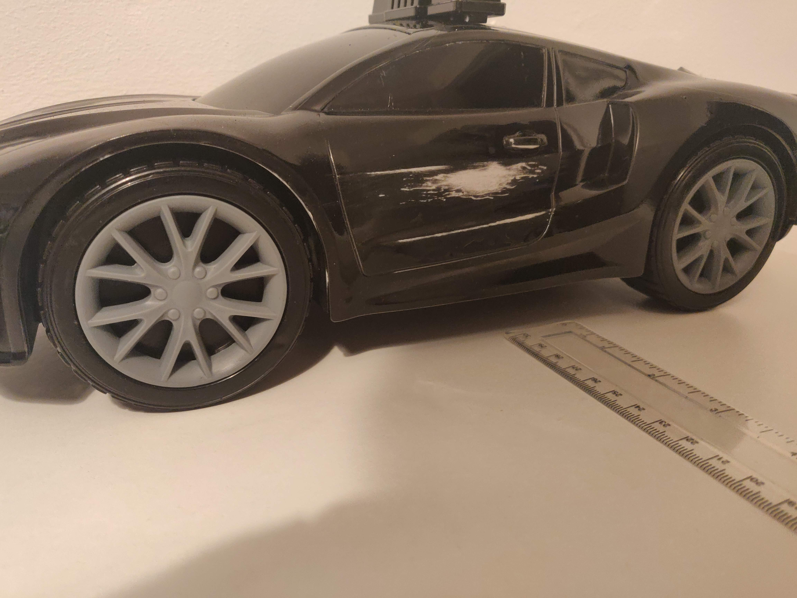|

I am currently developing two aspects of the enclosure, the actual hardware (cameras and rapberry pi), and the software which will actually capture the images and retrieve the cars registration plate.

The majority of the hardware will be constructed using wood for the frame, with a white acrylic bed which the car will sit on. I will also be 3d printing two custom camera mounts for the enclosure.

 | Current enclosure pieces |
 |:---:|
 |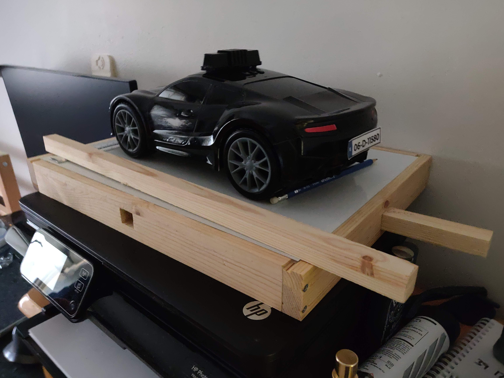|
 
 To retrieve the registration plate of the car from the image I am using Googles tesseract OCR and opencv. I am trying to adapt the steps followed by this tutorial online: https://www.pyimagesearch.com/2018/09/17/opencv-ocr-and-text-recognition-with-tesseract/
 
 I may have underestimated how long it would take me to complete development of the overall enclosure, but I hope to have it finished soon.
 
## 14. Updates
##### 10/04/19

I have not updated my blog much in the past weeks, this is due to a combination of completing other coursework and working on some of the more soft skills portions of the project. 

As I said, I have not been completing a heavy amount of development work. Since my last blog I have finalised the enclosure, I currently have the raspberry pi harvesting registration plates from a live video feed, capturing images to be analysed and sending them to the predictor API in order to be analysed. The overall enclosure now just needs to be stuck together.

I have added quite a few more tests, such as those testing the flask api and the predictions in makes. These have all been added to the gitlab pipeline which is run everytime I push a commit to the repository. 

As I was adding tests, I began writing up my testing report which will outline the steps I took in testing the system. I also began work on some of the diagrams necessary for the technical manual.

At the moment my plan is to have the vast majority of the project finalised before I begin exams, in order to allow me to focus better on them.

## 15. Finale
##### 18/05/19

The project deadline is tomorrow, I believe I have all of the requirements in place and ready to go. I recorded my video yesterday and uploaded it to drive. I put the finishing touches to my documents today and uploaded them as PDFs to gitlab. 

My demo is on Thursday following the Expo at 15:00, this leaves me with a few days to prepare the presentation slides as well as the poster which I will be using to explain my project on the day of the Expo